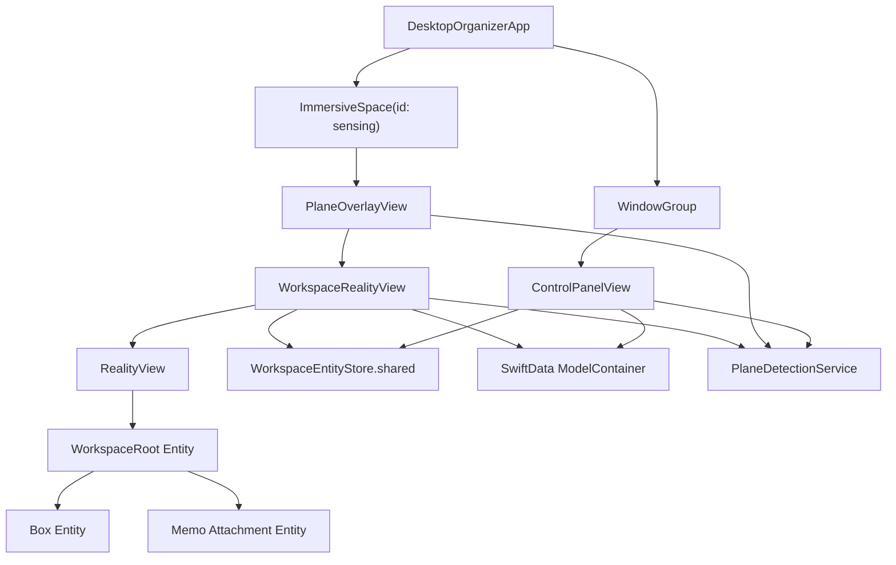
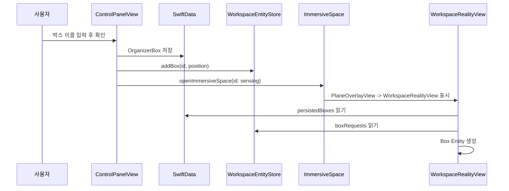

# 01. visionOS 앱의 기본 구조

Last updated: 2026-05-25

이 교재는 Desktop Organizer를 통해 visionOS 앱의 기본 구조를 공부하기 위한 첫 번째 교재다. 목표는 `WindowGroup`, `ImmersiveSpace`, `RealityView`, `Attachment`, `SwiftData`, `Environment`가 앱 안에서 어떻게 연결되는지 이해하는 것이다.

## 1. 이 주제를 먼저 배우는 이유

Desktop Organizer는 일반 iOS 앱처럼 하나의 화면에서 끝나지 않는다.

- 사용자가 처음 보는 조작 패널은 SwiftUI `WindowGroup`이다.
- 실제 책상 인식과 3D 박스/메모는 `ImmersiveSpace` 안에서 작동한다.
- `ImmersiveSpace` 안의 `WorkspaceRealityView`는 `RealityView`를 사용해 RealityKit entity를 직접 관리한다.
- 박스와 메모 정보는 SwiftData에 저장된다.
- 책상 인식 상태는 `PlaneDetectionService`가 앱 전체에 공유한다.

따라서 이 구조를 먼저 이해해야 이후의 RealityKit Entity, Spatial Interaction, World Anchor, SwiftData 교재를 자연스럽게 읽을 수 있다.

## 2. 전체 실행 흐름



앱은 두 개의 큰 출입구를 가진다.

| 출입구 | 역할 | 이 프로젝트의 파일 |
| --- | --- | --- |
| `WindowGroup` | 사용자가 보는 기본 조작 패널 | `DesktopOrganizer/App/DesktopOrganizerApp.swift`, `ControlPanelView.swift` |
| `ImmersiveSpace` | 실제 공간 인식과 3D entity 표시 | `DesktopOrganizer/App/DesktopOrganizerApp.swift`, `PlaneOverlayView.swift`, `WorkspaceRealityView.swift` |

## 3. 앱 시작점: DesktopOrganizerApp

먼저 읽을 파일은 `DesktopOrganizer/App/DesktopOrganizerApp.swift`다.

이 파일의 핵심 책임은 앱이 사용할 scene을 등록하는 것이다.

```swift
@main
struct DesktopOrganizerApp: App {
    @State var planeService = PlaneDetectionService()

    var body: some Scene {
        WindowGroup {
            ControlPanelView()
        }
        .windowResizability(.contentSize)
        .defaultSize(width: 360, height: 260)
        .modelContainer(for: [OrganizerBox.self, MemoItem.self])
        .environment(planeService)

        ImmersiveSpace(id: "sensing") {
            PlaneOverlayView()
        }
        .immersionStyle(selection: .constant(.mixed), in: .mixed)
        .modelContainer(for: [OrganizerBox.self, MemoItem.self])
        .environment(planeService)
    }
}
```

여기서 초보자가 봐야 할 것은 네 가지다.

1. `WindowGroup`은 앱을 켰을 때 보이는 기본 창이다.
2. `ImmersiveSpace(id: "sensing")`는 사용자가 버튼을 눌렀을 때 열리는 공간이다.
3. `.modelContainer`는 SwiftData 저장소를 두 scene에 연결한다.
4. `.environment(planeService)`는 같은 `PlaneDetectionService` 인스턴스를 패널과 공간이 공유하게 한다.

## 4. WindowGroup: ControlPanelView

`ControlPanelView`는 사용자가 처음 만나는 조작 패널이다.

이 view는 다음 일을 한다.

- 공간 시작/종료 버튼을 보여준다.
- 책상 다시 인식 버튼을 보여준다.
- 박스 이름을 입력받아 SwiftData에 저장한다.
- 새 박스를 `WorkspaceEntityStore.shared`에 요청한다.
- DEBUG 빌드에서 저장된 박스/메모 개수와 초기화 버튼을 보여준다.

핵심은 `WindowGroup` 안의 SwiftUI view가 직접 3D 박스를 그리지 않는다는 점이다. `ControlPanelView`는 박스를 저장하고, 공간에 표시해 달라는 요청만 보낸다.

```swift
@Environment(\.openImmersiveSpace) private var openImmersiveSpace
@Environment(\.dismissImmersiveSpace) private var dismissImmersiveSpace
@Environment(PlaneDetectionService.self) private var planeService
@State private var workspaceStore = WorkspaceEntityStore.shared
@Environment(\.modelContext) private var modelContext
@Query(sort: \OrganizerBox.createdAt) private var boxes: [OrganizerBox]
@Query(sort: \MemoItem.createdAt) private var memos: [MemoItem]
```

이 선언만 봐도 `ControlPanelView`가 여러 계층을 연결하는 패널이라는 것을 알 수 있다.

| 선언 | 의미 |
| --- | --- |
| `openImmersiveSpace` | mixed 공간을 열기 위한 SwiftUI 환경 함수 |
| `dismissImmersiveSpace` | 열린 mixed 공간을 닫기 위한 SwiftUI 환경 함수 |
| `planeService` | 책상 인식 상태를 읽고 재인식을 요청하는 서비스 |
| `workspaceStore` | 공간에 만들 entity 요청을 전달하는 런타임 store |
| `modelContext` | SwiftData 저장/삭제를 수행하는 context |
| `@Query boxes`, `@Query memos` | 저장된 박스/메모 목록 |

## 5. ImmersiveSpace: PlaneOverlayView

`PlaneOverlayView`는 이름만 보면 평면 표시 view처럼 보이지만, 현재 구조에서는 mixed immersive space 안에서 RealityKit 공간을 시작하는 진입점이다.

```swift
struct PlaneOverlayView: View {
    @Environment(PlaneDetectionService.self) private var planeService

    var body: some View {
        WorkspaceRealityView()
            .task {
                await planeService.startDetection()
            }
    }
}
```

중요한 점은 `PlaneOverlayView`가 열리는 순간 `planeService.startDetection()`이 실행된다는 것이다.

즉, 앱의 책상 인식은 기본 창이 아니라 `ImmersiveSpace`가 열린 뒤 시작된다.

## 6. RealityView: WorkspaceRealityView

`WorkspaceRealityView`는 실제 공간 오브젝트를 관리하는 중심 view다.

이 view는 `RealityView`를 사용한다.

```swift
RealityView { content, attachments in
    let root = Entity()
    root.name = "WorkspaceRoot"
    sceneState.rootEntity = root
    content.add(root)

    Task { @MainActor in
        await renderKnownBoxes()
        restoreSpatialMemoPresentations()
        applyKnownWorldAnchorTransforms()
    }

    updateTablePlaneDebugOverlay()
    updateSelectedBoxControls(attachments: attachments)
    updateOpenBoxMemoLists(attachments: attachments)
    updateDraggingMemoPreview(attachments: attachments)
    updateSpatialMemoPresentations(attachments: attachments)
} update: { content, attachments in
    updateTablePlaneDebugOverlay()
    updateSelectedBoxControls(attachments: attachments)
    updateOpenBoxMemoLists(attachments: attachments)
    updateDraggingMemoPreview(attachments: attachments)
    updateSpatialMemoPresentations(attachments: attachments)
} attachments: {
    // SwiftUI attachment 등록
}
```

`RealityView`는 크게 세 부분으로 나뉜다.

| 영역 | 언제 실행되는가 | 역할 |
| --- | --- | --- |
| 첫 번째 closure | `RealityView`가 처음 만들어질 때 | root entity 생성, 저장된 박스 복원, 초기 attachment 배치 |
| `update` closure | SwiftUI 상태가 바뀔 때 | 선택된 박스 컨트롤, 열린 메모 목록, 드래그 preview 갱신 |
| `attachments` closure | SwiftUI view를 RealityKit attachment로 등록할 때 | 박스 아래 컨트롤, 박스 위 메모 목록, 공간 메모 카드 등록 |

## 7. 왜 mixed ImmersiveSpace인가

`DesktopOrganizerApp.swift`에는 다음 설정이 있다.

```swift
.immersionStyle(selection: .constant(.mixed), in: .mixed)
```

`mixed`는 사용자가 실제 주변 공간을 보면서 앱의 3D 오브젝트를 함께 볼 수 있는 모드다.

이 프로젝트가 mixed를 쓰는 이유는 명확하다.

- 앱은 사용자의 실제 책상을 찾아야 한다.
- 박스와 메모는 그 책상 위에 놓여야 한다.
- 사용자는 실제 공간과 앱 오브젝트를 동시에 봐야 한다.

따라서 이 앱은 완전 몰입형 게임이 아니라, 실제 책상 위에 디지털 정리 도구를 얹는 mixed spatial app이다.

## 8. 데이터가 흐르는 방향

박스 생성 버튼을 누르면 흐름은 아래처럼 이어진다.



여기서 중요한 원칙은 이것이다.

저장 데이터는 SwiftData에 있고, 실제 보이는 공간 물체는 RealityKit entity다. 둘은 연결되지만 같은 객체가 아니다.

## 9. Environment가 필요한 이유

이 프로젝트에서는 `PlaneDetectionService`를 `@State`로 만들고 두 scene에 `.environment(planeService)`로 전달한다.

이유는 `ControlPanelView`, `PlaneOverlayView`, `WorkspaceRealityView`가 같은 책상 인식 상태를 봐야 하기 때문이다.

| View | `PlaneDetectionService`를 쓰는 이유 |
| --- | --- |
| `ControlPanelView` | 상태 문구 표시, 책상 다시 인식 요청, 박스 생성 위치 계산 |
| `PlaneOverlayView` | immersive space가 열릴 때 ARKit 평면 감지 시작 |
| `WorkspaceRealityView` | 감지된 평면 debug overlay 표시, WorldAnchor 반영 |

만약 각 view가 `PlaneDetectionService()`를 따로 만들면, 한쪽에서 감지한 책상 위치를 다른 쪽에서 볼 수 없다.

## 10. 이 구조에서 자주 헷갈리는 지점

### `WindowGroup`은 공간 오브젝트를 직접 표시하지 않는다

`ControlPanelView`는 버튼과 입력창을 가진 SwiftUI 창이다. 실제 박스 entity는 `WorkspaceRealityView`가 만든다.

### `ImmersiveSpace`는 항상 열려 있지 않다

현재 앱은 사용자가 `공간 시작` 또는 `박스 만들기` 흐름을 통해 immersive space를 연다. 그래서 `ControlPanelView`에는 `isSensingOpen`, `isOpeningSensing` 같은 상태가 있다.

### `PlaneOverlayView`는 중간 진입점이다

공간이 열리면 `PlaneOverlayView`가 나오고, 그 안에서 `WorkspaceRealityView`가 표시된다. ARKit 평면 감지도 이 시점에 시작된다.

### `WorkspaceEntityStore.shared`는 저장소가 아니다

`WorkspaceEntityStore`는 SwiftData 같은 영구 저장소가 아니라, 현재 실행 중인 공간에 어떤 entity를 표시할지 알려주는 런타임 store다.

## 11. 코드 읽는 순서

처음 이 프로젝트를 공부한다면 아래 순서가 좋다.

1. `DesktopOrganizer/App/DesktopOrganizerApp.swift`
2. `DesktopOrganizer/Views/ControlPanelView.swift`
3. `DesktopOrganizer/Views/PlaneOverlayView.swift`
4. `DesktopOrganizer/Views/WorkspaceRealityView.swift`
5. `DesktopOrganizer/Services/WorkspaceEntityStore.swift`
6. `DesktopOrganizer/Views/WorkspaceRealityState.swift`
7. `DesktopOrganizer/Models/OrganizerBox.swift`
8. `DesktopOrganizer/Models/MemoItem.swift`

## 12. 실기기와 시뮬레이터에서 확인할 것

| 확인 항목 | 시뮬레이터 | Vision Pro 실기기 |
| --- | --- | --- |
| `WindowGroup` 패널 표시 | 확인 가능 | 확인 가능 |
| `ImmersiveSpace` 열기/닫기 | 확인 가능 | 확인 가능 |
| mixed 공간에서 entity 표시 | 제한적으로 확인 가능 | 확인 가능 |
| ARKit 책상 평면 감지 | 제한적 | 필수 확인 |
| WorldAnchor 추가 | 지원 안 될 수 있음 | 필수 확인 |
| 실제 책상 위 위치감 | 확인 어려움 | 필수 확인 |

특히 Simulator에서는 `Adding world anchors is not supported on Simulator.` 같은 메시지가 나올 수 있다. 이것은 앱 구조 문제라기보다 실행 환경의 제한이다.

## 13. 다음 교재와의 연결

이 교재를 읽은 뒤에는 아래 순서로 넘어가면 좋다.

1. `02-swiftui-state-for-spatial-apps.html`
2. `03-swiftdata-for-spatial-objects.html`
3. `04-realitykit-entity-design-guide.html`
4. `05-attachment-ornament-window-guide.html`

ECS 교재는 RealityKit Entity 설계까지 본 뒤 읽는 것이 좋다.

## 14. 체크리스트

아래 질문에 답할 수 있으면 1번 교재의 목표를 달성한 것이다.

- `WindowGroup`과 `ImmersiveSpace`의 역할 차이를 설명할 수 있는가?
- `ControlPanelView`가 직접 3D 박스를 만들지 않는 이유를 설명할 수 있는가?
- `PlaneOverlayView`가 왜 필요한지 설명할 수 있는가?
- `WorkspaceRealityView`의 `RealityView`가 어떤 일을 하는지 말할 수 있는가?
- SwiftData 모델과 RealityKit entity가 왜 다른지 구분할 수 있는가?
- `.environment(planeService)`를 두 scene에 모두 넣는 이유를 설명할 수 있는가?
