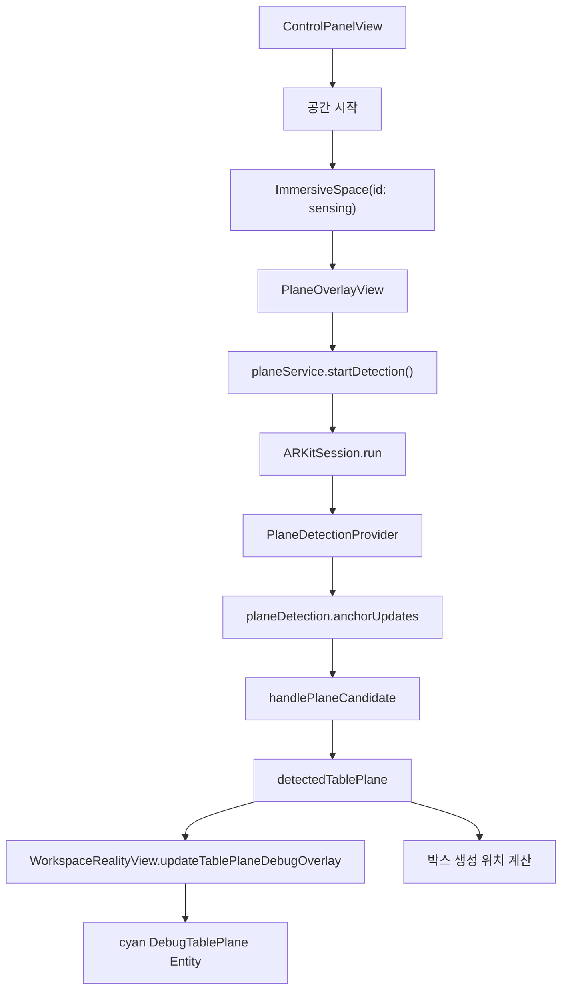

# 07. ARKit Plane Detection: 책상 평면 찾기

Last updated: 2026-05-26

이 교재는 Desktop Organizer를 통해 ARKit 평면 인식을 공부하기 위한 일곱 번째 교재다. 목표는 앱이 실제 공간에서 책상 후보 평면을 어떻게 찾고, 왜 감지된 평면을 cyan overlay로 보여주며, 재인식과 fallback 위치를 어떻게 다루는지 이해하는 것이다.

## 1. 이 주제를 배우는 이유

Desktop Organizer의 최종 형태는 "사용자의 책상 위에 디지털 박스와 메모를 놓는 앱"이다.

따라서 첫 번째 공간 문제는 박스가 아니다. 책상이다.

앱이 책상을 안정적으로 찾지 못하면 다음 문제가 생긴다.

- 박스가 공중에 뜬 것처럼 보인다.
- 박스가 책상 아래로 파고든다.
- 감지된 면이 계속 바뀌어 불안정하게 느껴진다.
- 사용자는 앱이 어느 면을 책상으로 잡았는지 알 수 없다.
- 박스 생성 위치가 매번 예측하기 어렵다.

이 교재는 이 문제를 ARKit plane detection 코드 기준으로 설명한다.

## 2. 현재 구현의 큰 그림



핵심 파일은 세 개다.

| 파일 | 역할 |
| --- | --- |
| `PlaneDetectionService.swift` | ARKit session, plane provider, 후보 선택, 재인식 상태 관리 |
| `PlaneOverlayView.swift` | immersive space가 열릴 때 평면 인식 시작 |
| `WorkspaceRealityView+Boxes.swift` | 감지된 평면을 cyan debug entity로 표시 |

## 3. 감지는 ImmersiveSpace 안에서 시작된다

평면 인식은 일반 `WindowGroup`이 아니라 mixed `ImmersiveSpace` 안에서 시작된다.

```swift
struct PlaneOverlayView: View {
    @Environment(PlaneDetectionService.self) private var planeService

    var body: some View {
        WorkspaceRealityView()
            .task {
                await planeService.startDetection()
            }
    }
}
```

`PlaneOverlayView`는 화면 UI를 그리는 view라기보다 ARKit 감지를 시작하는 진입점이다.

사용자가 `공간 시작`을 누르면 immersive space가 열리고, 그 안에서 `PlaneOverlayView`가 나타나며 `startDetection()`이 실행된다.

## 4. PlaneDetectionService의 역할

`PlaneDetectionService`는 UI view가 아니라 ARKit 상태와 session을 관리하는 공유 서비스다.

```swift
@Observable
@MainActor
final class PlaneDetectionService {
    var statusText: String = "공간 시작 대기"
    var detectedTablePlane: PlaneAnchor?
    var tablePlaneDebugRevision = 0
    var worldAnchorRevision = 0
}
```

이 서비스는 `DesktopOrganizerApp`에서 하나만 만들어 environment로 공유한다.

그래야 `PlaneOverlayView`가 감지를 시작하고, `ControlPanelView`가 같은 `statusText`를 표시하며, `WorkspaceRealityView`가 같은 `detectedTablePlane`을 읽을 수 있다.

## 5. ARKitSession과 Provider

평면 인식은 `ARKitSession`과 `PlaneDetectionProvider`로 시작한다.

```swift
private var arkitSession = ARKitSession()
private var planeDetection = PlaneDetectionProvider(alignments: [.horizontal])
private var worldTracking = WorldTrackingProvider()
```

현재 앱은 horizontal plane만 요청한다.

```swift
PlaneDetectionProvider(alignments: [.horizontal])
```

이 말은 ARKit이 수평면을 찾는다는 뜻이다. 여기에는 책상, 바닥, 선반 같은 수평 표면이 모두 들어올 수 있다.

그래서 "ARKit이 table semantic을 직접 준다"가 아니라, 앱이 수평면 중 책상 후보로 쓸 만한 것을 골라내는 구조다.

## 6. 지원 여부 확인

ARKit 기능은 실행 환경에 따라 지원되지 않을 수 있다.

```swift
guard PlaneDetectionProvider.isSupported else {
    statusText = "이 기기에서 지원되지 않음"
    return
}
```

Simulator나 일부 환경에서는 실제 plane detection을 제대로 확인하기 어렵다.

이 경우 앱이 crash하지 않고 status text로 알려주는 것이 중요하다.

## 7. 감지 시작 흐름

`startDetection()`은 중복 실행을 막고, ARKit session을 실행한다.

```swift
func startDetection() async {
    guard !isDetectionRunning else {
        return
    }

    guard PlaneDetectionProvider.isSupported else {
        statusText = "이 기기에서 지원되지 않음"
        return
    }

    do {
        isDetectionRunning = true
        detectionGeneration += 1
        let generation = detectionGeneration

        if WorldTrackingProvider.isSupported {
            try await arkitSession.run([planeDetection, worldTracking])
            await refreshWorldAnchorCache()
            startWorldAnchorUpdatesIfNeeded()
        } else {
            try await arkitSession.run([planeDetection])
        }
    } catch {
        statusText = "인식 실패: \(error.localizedDescription)"
    }
}
```

World Tracking이 지원되면 plane detection과 world tracking을 같은 session에서 함께 실행한다.

평면 인식은 책상 찾기에 필요하고, world tracking은 이후 WorldAnchor 복원에 필요하다.

## 8. anchorUpdates를 계속 듣는다

ARKit은 평면을 한 번만 주는 것이 아니다. 평면이 추가되거나 갱신되거나 삭제될 때마다 update를 보낸다.

```swift
for await update in planeDetection.anchorUpdates {
    guard isDetectionRunning,
          generation == detectionGeneration,
          !Task.isCancelled
    else {
        break
    }

    switch update.event {
    case .added, .updated:
        handlePlaneCandidate(update.anchor)
    case .removed:
        ...
    }
}
```

여기서 `generation`은 오래된 감지 loop가 새 상태를 건드리지 못하게 하는 안전장치다.

`stopDetection()`이나 재시작이 일어나면 `detectionGeneration`이 바뀌므로 이전 loop는 더 이상 유효하지 않다.

## 9. 책상 후보를 잠그는 이유

ARKit은 계속 새로운 평면 후보를 보낼 수 있다. 매번 새 후보로 책상을 바꾸면 사용자는 앱이 불안정하다고 느낀다.

그래서 현재 구현은 첫 usable plane을 찾으면 그 plane id를 잠근다.

```swift
private var lockedTablePlaneID: UUID?
```

```swift
private func selectTablePlaneIfNeeded(_ plane: PlaneAnchor) {
    guard lockedTablePlaneID == nil,
          isUsableTableCandidate(plane)
    else {
        return
    }

    lockedTablePlaneID = plane.id
    detectedTablePlane = plane
    scheduleTablePlaneDebugRevisionUpdate()
    statusText = "책상 고정됨 ✓ \(formattedPlaneSize(plane))"
}
```

이 구조 덕분에 한 번 책상 후보를 잡은 뒤에는 다른 바닥/선반 후보가 들어와도 기준 평면이 갑자기 바뀌지 않는다.

## 10. usable table candidate 기준

현재 앱은 진짜 책상 semantic을 판별하지 않는다. 수평면의 크기를 보고 책상 후보로 쓸 수 있는지 판단한다.

```swift
private func isUsableTableCandidate(_ plane: PlaneAnchor) -> Bool {
    let width = plane.geometry.extent.width
    let depth = plane.geometry.extent.height
    let longEdge = max(width, depth)
    let shortEdge = min(width, depth)
    let area = width * depth

    return longEdge > 0.2 && shortEdge > 0.08 && area <= 8.0
}
```

기준은 세 가지다.

| 기준 | 이유 |
| --- | --- |
| 긴 변 `0.2m` 초과 | 너무 작은 조각은 제외 |
| 짧은 변 `0.08m` 초과 | 얇은 선 같은 후보는 제외 |
| 면적 `8.0㎡` 이하 | 너무 큰 바닥면일 가능성 낮춤 |

ARKit은 책상을 처음부터 완성된 직사각형으로 주지 않을 수 있다. 그래서 기준을 너무 크게 잡으면 초기에 책상을 못 찾는다.

## 11. 감지 상태 문구

`statusText`는 사용자가 현재 상태를 알 수 있게 한다.

```swift
statusText = "책상 후보 확인 중... \(formattedPlaneSize(plane))"
```

책상 후보가 고정되면:

```swift
statusText = "책상 고정됨 ✓ \(formattedPlaneSize(plane))"
```

선택된 평면이 사라지면:

```swift
statusText = "책상 후보 사라짐, 다시 인식 중..."
```

공간 인식은 눈에 안 보이면 사용자가 믿기 어렵다. 그래서 상태 문구와 시각 overlay가 같이 필요하다.

## 12. 감지된 평면을 cyan으로 보여주기

감지된 책상 후보는 `WorkspaceRealityView`에서 cyan plane entity로 표시한다.

```swift
let width = max(tablePlane.geometry.extent.width, 0.1)
let depth = max(tablePlane.geometry.extent.height, 0.1)
let mesh = MeshResource.generatePlane(width: width, depth: depth)
let material = SimpleMaterial(
    color: UIColor.cyan.withAlphaComponent(0.45),
    roughness: 0.7,
    isMetallic: false
)
```

그리고 `ModelEntity`에 model component를 넣는다.

```swift
let debugEntity = sceneState.tablePlaneDebugEntity ?? ModelEntity()
debugEntity.name = "DebugTablePlane"
debugEntity.model = ModelComponent(mesh: mesh, materials: [material])
debugEntity.transform.matrix = tablePlane.originFromAnchorTransform
```

이 entity는 실제 제품 UI라기보다 "앱이 어느 면을 책상으로 잡았는지" 확인하기 위한 디버그 시각화다.

## 13. z-fighting 방지

debug plane을 감지된 평면과 완전히 같은 높이에 두면 깜빡이는 현상이 생길 수 있다.

그래서 아주 조금 위로 올린다.

```swift
debugEntity.position.y += 0.003
```

이 값은 3mm 정도다. 사용자는 거의 느끼지 못하지만 렌더링 깜빡임을 줄이는 데 도움이 된다.

## 14. debug overlay 갱신을 묶는 이유

plane anchor는 짧은 시간에 여러 번 흔들리며 갱신될 수 있다. 매 update마다 RealityView를 갱신하면 불필요한 redraw가 많아진다.

그래서 80ms 동안 들어온 변경을 하나로 묶는다.

```swift
private func scheduleTablePlaneDebugRevisionUpdate() {
    guard pendingTablePlaneDebugRevisionTask == nil else {
        return
    }

    pendingTablePlaneDebugRevisionTask = Task { @MainActor in
        try? await Task.sleep(for: .milliseconds(80))
        tablePlaneDebugRevision += 1
        pendingTablePlaneDebugRevisionTask = nil
    }
}
```

`WorkspaceRealityView`는 이 revision을 보고 overlay를 갱신한다.

```swift
.task(id: planeService.tablePlaneDebugRevision) {
    updateTablePlaneDebugOverlay()
}
```

## 15. 박스 생성 위치와 fallback

감지된 평면이 있으면 그 중심 좌표를 사용한다.

```swift
var tablePlaneOrigin: (x: Float, y: Float, z: Float) {
    guard let plane = detectedTablePlane else {
        return (0, -0.3, -0.8)
    }

    let col = plane.originFromAnchorTransform.columns.3
    return (col.x, col.y, col.z)
}
```

`ControlPanelView`는 이 값을 받아 박스 위치를 만든다.

```swift
if planeService.detectedTablePlane == nil {
    return SIMD3<Float>(offsetX, 1.0, -1.0)
}

return SIMD3<Float>(origin.x + offsetX, origin.y, origin.z)
```

여기서 fallback이 두 단계로 보일 수 있다.

| 위치 | 의미 |
| --- | --- |
| `tablePlaneOrigin`의 `(0, -0.3, -0.8)` | service가 감지 전일 때 제공하는 기본 origin |
| `ControlPanelView`의 `SIMD3(offsetX, 1.0, -1.0)` | 감지 평면이 없을 때 실제 박스 생성에 쓰는 사용자 앞 fallback |

현재 실제 박스 fallback은 `ControlPanelView`의 `SIMD3(offsetX, 1.0, -1.0)`이다.

## 16. 박스가 평면 위에 놓이는 방식

감지된 평면의 y 좌표를 그대로 박스 root position으로 쓴다.

하지만 USDZ 모델 자체의 바닥 위치는 모델 pivot과 bounds에 따라 다를 수 있다. 그래서 `WorkspaceRealityView`가 모델의 visual bounds를 보고 보정한다.

```swift
func placeTravelCaseOnRootPlane(_ entity: Entity) {
    let bounds = entity.visualBounds(relativeTo: entity)
    entity.position.y = -bounds.min.y + travelCaseSurfaceOffset
}
```

`travelCaseSurfaceOffset`은 실기기에서 모델이 뜨거나 파고드는 문제를 미세 조정하기 위한 값이다.

```swift
let travelCaseSurfaceOffset: Float = -0.12
```

평면 인식이 맞아도 모델 pivot 보정이 틀리면 박스가 떠 보이거나 파고들 수 있다.

## 17. 다시 인식 버튼

사용자가 책상 인식이 마음에 들지 않으면 다시 인식을 요청할 수 있다.

```swift
func requestTableRescan() {
    lockedTablePlaneID = nil
    detectedTablePlane = nil
    tablePlaneDebugRevision += 1
    statusText = "책상 다시 인식 중..."
}
```

이 함수는 ARKit session을 완전히 다시 시작하지는 않는다. 현재 감지 loop는 유지하고, 잠긴 plane id와 선택된 plane만 비운다.

그러면 다음 usable plane이 다시 책상 후보로 선택될 수 있다.

## 18. 공간 종료와 감지 정리

공간을 종료하면 ARKit session과 provider 상태를 정리한다.

```swift
func stopDetection() {
    isDetectionRunning = false
    detectionGeneration += 1
    arkitSession.stop()
    worldAnchorUpdateTask?.cancel()
    worldAnchorUpdateTask = nil

    lockedTablePlaneID = nil
    detectedTablePlane = nil
    tablePlaneDebugRevision += 1

    arkitSession = ARKitSession()
    planeDetection = PlaneDetectionProvider(alignments: [.horizontal])
    worldTracking = WorldTrackingProvider()
}
```

provider를 새로 만드는 이유는 다음 `공간 시작` 때 깨끗한 `anchorUpdates` sequence로 다시 시작하기 위해서다.

## 19. 왜 간헐적으로 못 찾을 수 있나

실기기에서 책상 평면을 잘 읽다가도 간헐적으로 못 찾는 경우가 있다. 가능한 원인은 여러 가지다.

| 원인 | 설명 |
| --- | --- |
| 표면 질감 부족 | 단색/반사/유리 표면은 특징점이 적을 수 있음 |
| 조명 부족 | ARKit이 평면 경계를 안정적으로 추정하기 어려움 |
| 초기 시선 각도 | 책상 면을 충분히 비스듬히 보지 못하면 면적이 작게 잡힐 수 있음 |
| 기준값 과함 | long/short/area 필터가 특정 책상에 맞지 않을 수 있음 |
| 너무 큰 바닥 후보 | 바닥을 먼저 잡거나 책상보다 안정적인 후보로 볼 수 있음 |
| ARKit update 지연 | 처음에는 작은 조각으로 들어오고 시간이 지나며 커질 수 있음 |

그래서 이 앱은 재인식 버튼과 cyan overlay를 둔다.

## 20. 개선 아이디어

현재 구현은 "첫 usable horizontal plane을 잠근다"는 단순하고 안정적인 방식이다.

더 개선하려면 다음을 고려할 수 있다.

- 일정 시간 동안 후보를 모은 뒤 가장 책상다운 평면 선택
- 사용자 gaze 또는 손 위치 근처의 평면 우선
- 너무 낮은 y 좌표의 큰 평면은 바닥으로 보고 제외
- 박스 생성 전 사용자가 cyan plane을 보고 확정하는 단계 추가
- 후보 평면 여러 개를 다른 색으로 표시하고 선택하게 하기
- 책상 인식 실패 시 카메라를 어디로 향하면 좋은지 안내

다만 지금 단계에서는 "감지된 면을 명확히 보여주고, 사용자가 다시 인식할 수 있게 하는 것"이 가장 중요하다.

## 21. Apple 문서와의 연결

이 프로젝트의 공간 인식 방향은 Apple의 "placing content on detected planes" 흐름과 같은 문제를 다룬다.

참고 문서:

- https://developer.apple.com/documentation/visionOS/placing-content-on-detected-planes

이 문서의 핵심도 "ARKit이 감지한 plane을 기준으로 content를 배치한다"는 것이다. Desktop Organizer는 여기에 책상 후보 선택, cyan debug overlay, 재인식 버튼, 박스 fallback 위치를 더한 형태다.

## 22. 실기기에서 확인할 것

| 확인 항목 | 봐야 할 것 |
| --- | --- |
| 공간 시작 | statusText가 감지 중 상태로 바뀌는가 |
| 책상 후보 | cyan plane이 실제 책상 위에 보이는가 |
| 후보 고정 | 한 번 잡힌 뒤 다른 면으로 계속 바뀌지 않는가 |
| 다시 인식 | 버튼을 누르면 cyan plane이 사라졌다가 새 후보로 잡히는가 |
| 박스 생성 | 감지된 책상 중심에 박스가 생기는가 |
| fallback | 감지 전에는 사용자 앞 기본 위치에 생기는가 |
| 높이 | 박스가 평면 위에 놓이는가, 뜨거나 파고들지 않는가 |
| 큰 바닥면 | 바닥을 책상으로 오인하지 않는가 |

## 23. 코드 읽는 순서

ARKit 평면 인식을 공부하려면 아래 순서가 좋다.

1. `DesktopOrganizer/App/DesktopOrganizerApp.swift`
2. `DesktopOrganizer/Views/ControlPanelView.swift`
3. `DesktopOrganizer/Views/PlaneOverlayView.swift`
4. `DesktopOrganizer/Services/PlaneDetectionService.swift`
5. `DesktopOrganizer/Views/WorkspaceRealityView+Boxes.swift`
6. `DesktopOrganizer/Views/WorkspaceRealityView.swift`

## 24. 다음 교재와의 연결

이 교재를 읽은 뒤에는 `08-world-anchor-persistence-guide.html`로 넘어가면 좋다.

7번 교재에서 책상 평면을 찾아 박스를 처음 놓는 방법을 배웠다면, 8번 교재에서는 앱을 다시 실행했을 때 박스와 메모가 원래 위치로 돌아오도록 WorldAnchor와 저장 상태를 연결하는 방법을 공부한다.

## 25. 체크리스트

아래 질문에 답할 수 있으면 7번 교재의 목표를 달성한 것이다.

- `PlaneOverlayView`가 왜 필요한지 설명할 수 있는가?
- `PlaneDetectionProvider(alignments: [.horizontal])`이 어떤 평면을 찾는지 말할 수 있는가?
- `lockedTablePlaneID`가 왜 필요한지 설명할 수 있는가?
- `isUsableTableCandidate`의 기준이 무엇을 걸러내는지 말할 수 있는가?
- cyan debug plane이 왜 필요한지 설명할 수 있는가?
- 박스 높이는 plane y 좌표뿐 아니라 모델 bounds 보정도 필요하다는 것을 설명할 수 있는가?
- 재인식 버튼이 session 재시작이 아니라 선택 plane reset이라는 점을 설명할 수 있는가?
